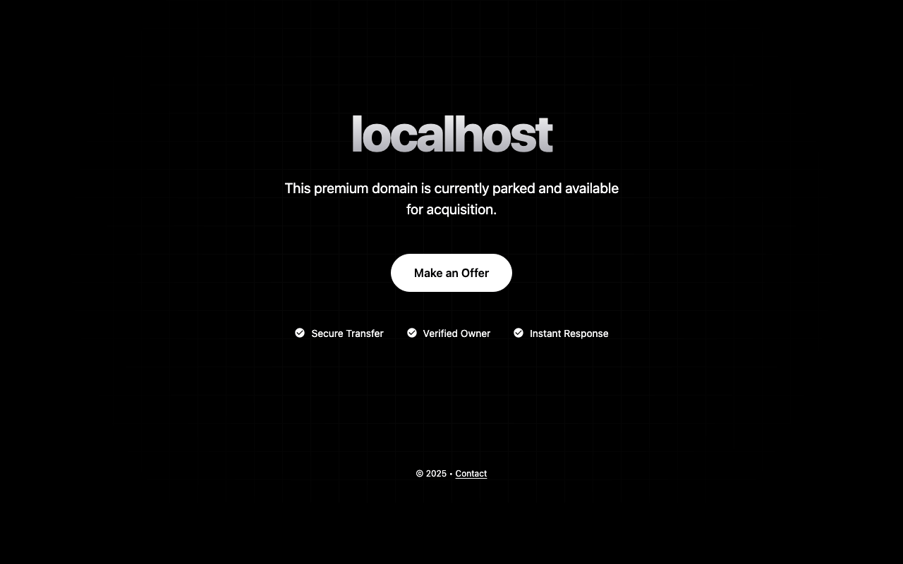

# Premium Parking Page

A high-performance, single-file domain parking page designed for speed (100/100 Lighthouse), accessibility, and SEO.

## Features

- **Dynamic**: Automatically detects the domain name it's hosted on.
- **Fast**: Inline styles, no external requests, caching enabled.
- **Theme**: Dark/Light mode support with a clean, premium aesthetic.

## Usage

### 1. Customization

Most content is dynamic, but you might want to change the contact email.

- **Email**: Open `index.html` and search for `hello@doguyilmaz.com`. Replace all occurrences.
- **Favicon**: Open `index.html` and look for `<link rel="icon" ...>`. Replace the `href` with your own image URL or Base64 data.

### 2. Multi-Domain Support

You don't need to change the code for different domains. Just deploy this same code to any domain, and the script will automatically display the correct domain name (e.g., visiting `example.com` shows "example.com is for sale").

## Deployment

### Vercel (Recommended)

1. Install Vercel CLI: `npm i -g vercel`
2. Run `vercel deploy --prod` in this directory.
3. Link your domains in the Vercel Dashboard.

### Netlify

1. Drag and drop this folder into the Netlify Dashboard.
2. Or use CLI: `netlify deploy --prod`.

### Cloudflare Pages

1. Push this code to a Git repository (GitHub/GitLab).
2. Create a new Project in Cloudflare Pages and select the repo.
3. Build command: (leave empty).
4. Output directory: `.` (or specifically the root).

### Generic / FTP

Simply upload `index.html`, `robots.txt`, `sitemap.xml`, and `manifest.json` to your server's `public_html` folder.
